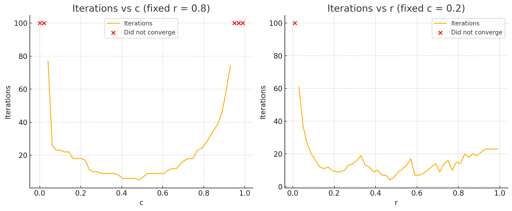

# Armijo vs Newton vs Golden Section on a 1D Function

**Quarter:** Spring 2025  

In this project we minimized a one-dimensional nonlinear function using three different numerical methods and studied how the Armijo line search parameters affect convergence speed. The target function is $f(x) = (x-1)^2 + \cos^2(x/2)$, which has a non-trivial global minimum that cannot be found in closed form.

## Contents

| File                      | Description                                                                                                                                                                                              |
| ------------------------- | -------------------------------------------------------------------------------------------------------------------------------------------------------------------------------------------------------- |
| `derivative_analysis.py`  | Uses SymPy to compute the derivative of $f$ symbolically and find critical points analytically.                                                                                                          |
| `armijo_search.py`        | Implements gradient descent with an Armijo backtracking line search ($c = 0.2$, $r = 0.8$, $\alpha_0 = 1$) starting from two initial points: $x_0 = 4.0$ and $x_0 = -2.0$.                             |
| `newton_method.py`        | Applies Newton's method using symbolic derivatives from SymPy. Converges faster than gradient descent by using second-order curvature information.                                                       |
| `golden_section.py`       | Uses the Golden Section search to bracket and narrow down the minimizer over the interval $[0, 3]$ without any derivative information.                                                                   |

## Background

Each of these methods iteratively refines a guess for the minimizer. The **step size** (or **step length**), written $\alpha$, is how far we move along the chosen direction at each step: starting from a point $x_k$ and direction $d_k$, the next iterate is $x_{k+1} = x_k + \alpha d_k$. Choosing $\alpha$ well matters because too small a step means slow progress, while too large a step can overshoot the minimum or even increase $f$.

The **Armijo condition** is a rule for choosing $\alpha$ that is large enough to make meaningful progress but small enough to guarantee descent. At each iteration, we start with an initial step $\alpha_0$ and shrink it by a factor $r$ until

$$f(x + \alpha d) \leq f(x) + c \cdot \alpha \cdot \nabla f(x)^\top d$$

is satisfied, where $d$ is the descent direction and $c$ is a small constant controlling the required decrease. The parameters $c$ and $r$ control how aggressively the step size is reduced.

**Newton's method** uses both the first and second derivative at each iterate to compute the next point:

$$x_{k+1} = x_k - \frac{f'(x_k)}{f''(x_k)}$$

This quadratic local approximation makes Newton's method converge much faster near a minimum, though it requires computing the second derivative.

The **Golden Section search** is a bracket-narrowing method that does not use derivatives at all. It works by maintaining an interval $[a, b]$ and evaluating the function at two interior points chosen according to the golden ratio, then discarding whichever half cannot contain the minimum.

## Results

All three methods locate the same minimum.

### Armijo Line Search (Gradient Descent)

Starting from $x_0 = 4.0$:
```
Iteration 0:  x = 4.000000,  f(x) = 9.7163
...
Iteration 24: x = 1.538305,  f(x) = 0.432635

Minimum found at x = 1.5383047, f(x) = 0.4326354, after 24 iterations.
```

Starting from $x_0 = -2.0$:
```
Minimum found at x = 1.5383045, f(x) = 0.4326354, after 19 iterations.
```

### Newton's Method

Starting from $x_0 = 2.0$:
```
Iteration 0: x = 2.000000, f(x) = 1.291926
Iteration 1: x = 1.651794, f(x) = 0.521372
Iteration 2: x = 1.542137, f(x) = 0.433490
Iteration 3: x = 1.538308, f(x) = 0.432635
Iteration 4: x = 1.538305, f(x) = 0.432635
Iteration 5: x = 1.538305, f(x) = 0.432635

Converged in 5 iterations.
```

Newton's method converges in 5 iterations compared to 24 for Armijo gradient descent, reflecting the faster local convergence that comes from using second-order information.

### Golden Section Search

Over the interval $[0, 3]$:
```
Iteration 0:  a = 0.000000, b = 3.000000
...
Iteration 26: a = 1.538295, b = 1.538317

Estimated Minimizer: 1.5383058
Minimum Value: 0.4326354
```

Converged in 27 iterations, matching the result from the derivative-based methods without requiring any gradient computation.

### Parameter Sensitivity Analysis

We conducted a parameter sensitivity analysis on the Armijo method to see how the choice of $c$ and $r$ affects convergence speed. The figure below shows how the number of iterations required by the Armijo method changes as $c$ and $r$ vary (starting from $x_0 = 4.0$). The left plot fixes $r = 0.8$ and varies $c$; the right plot fixes $c = 0.2$ and varies $r$.



A smaller $c$ (looser sufficient decrease condition) accepts steps more readily, reducing backtracking but potentially making less conservative progress. A larger $r$ (slower step shrinkage) keeps the step size bigger, which reduces backtracking but can slow convergence if steps consistently overshoot. The plots show that iteration count is more sensitive to $r$ than to $c$ over the tested ranges.

## Running

Each script can be run directly with Python:

```bash
python derivative_analysis.py
python armijo_search.py
python newton_method.py
python golden_section.py
```

Dependencies: `numpy`, `sympy`
